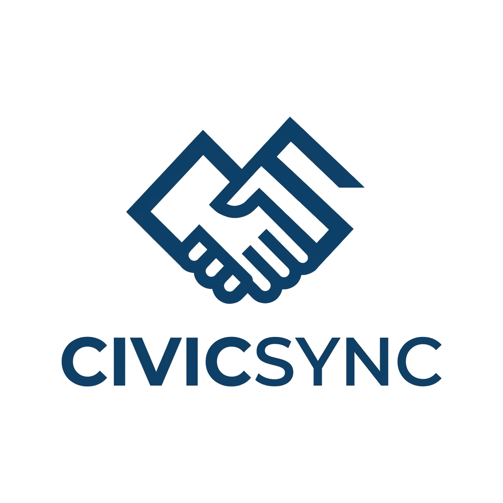
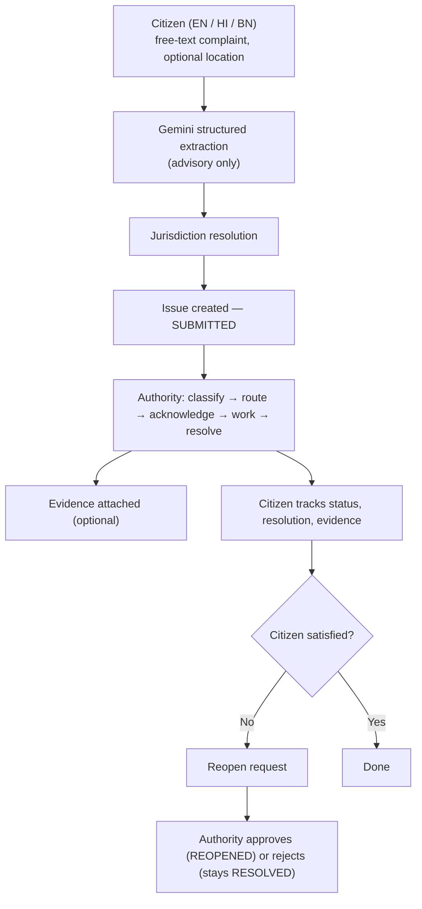
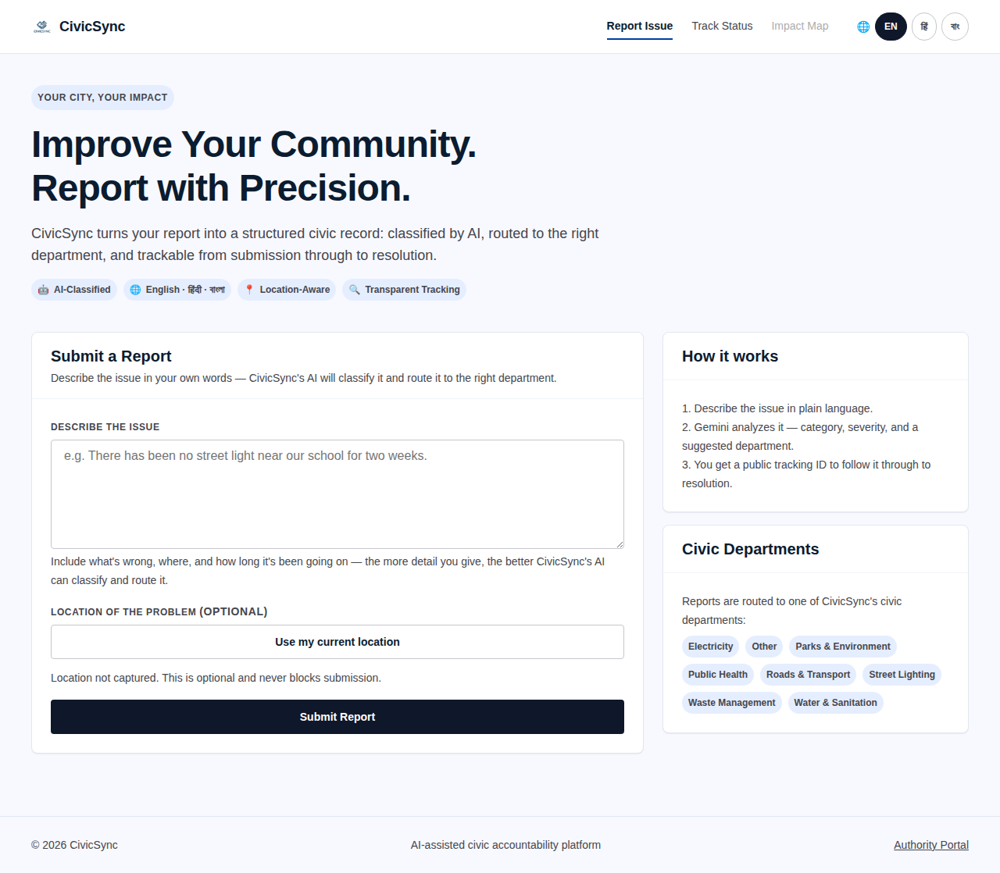
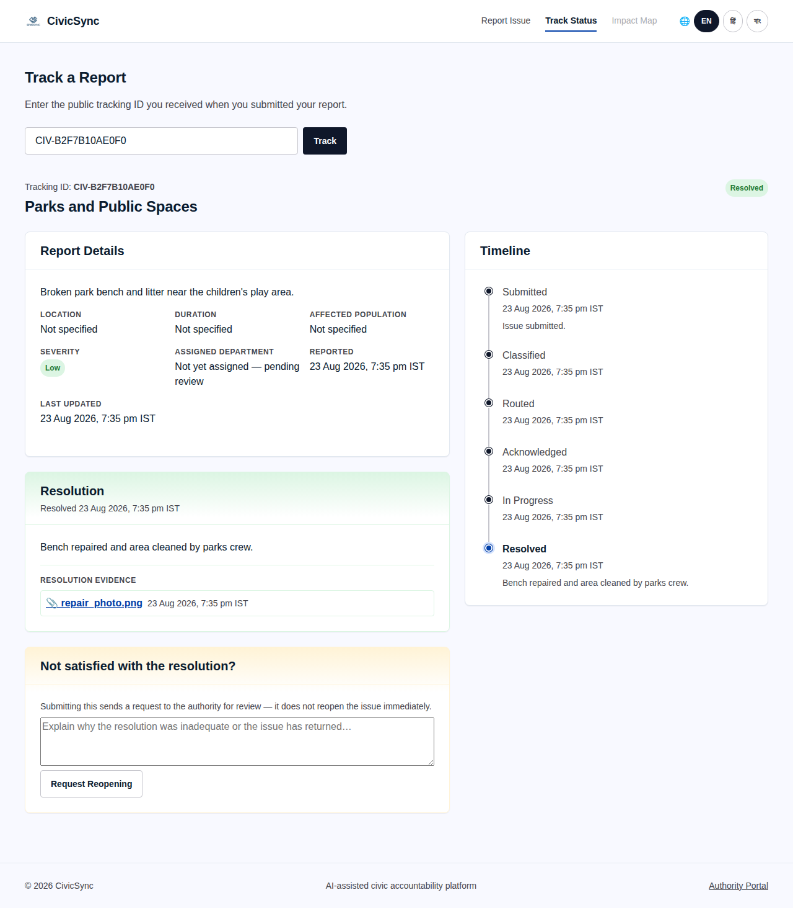
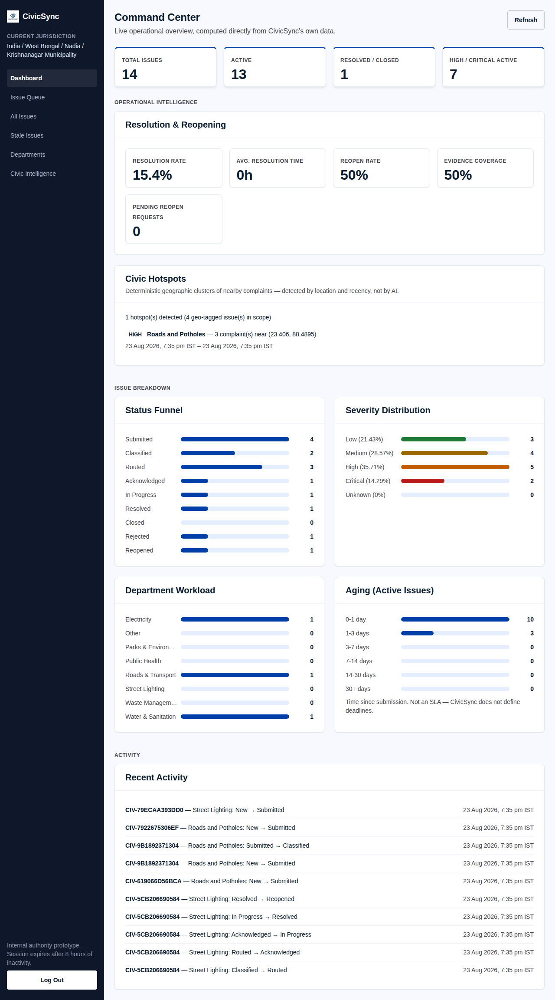
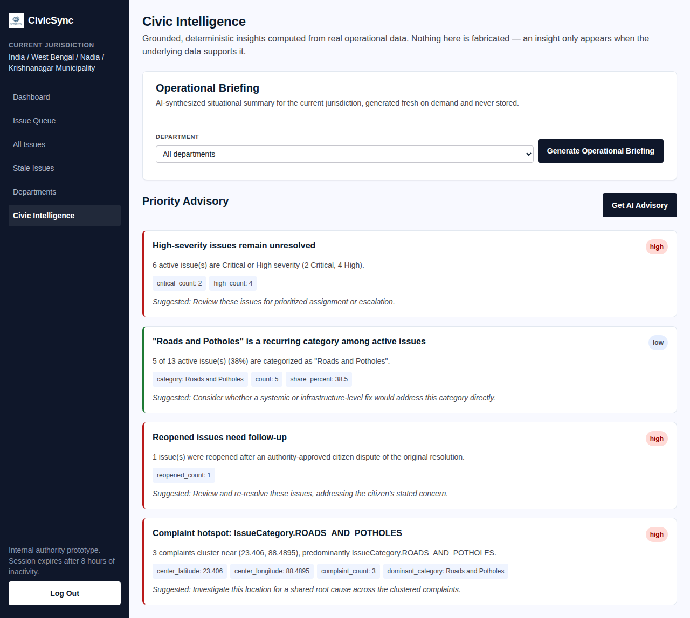
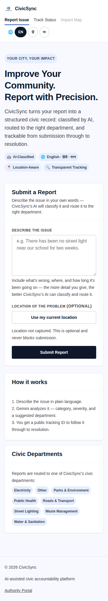

<div align="center">



# CivicSync

### AI-assisted civic issue reporting, routing, and accountability — built for real municipal workflows.

<p>
  <em>Citizen complaint → AI understanding → jurisdiction routing → authority action → resolution → evidence → citizen transparency</em>
</p>

[](#-tech-stack)
[](#-tech-stack)
[](#-ai-layer--boundaries)
[](#-multilingual-support)
[](#-running-tests)
[](#-honest-limitations)

</div>

<br/>

## 📖 Overview

CivicSync turns an unstructured citizen complaint — typed in **English, Hindi, or Bengali**, spelling mistakes and all — into a structured, trackable civic record: classified by category and severity, routed toward the right department, and followed all the way through to an authority's official resolution.

This is a working prototype, not a production deployment. Every claim in this document describes code that actually exists in this repository today — nothing here is aspirational.

## 🎯 Problem being solved

Civic complaint reporting in many municipalities is fragmented: phone calls, paper forms, or scattered messages that are hard to categorize, prioritize, or follow up on.

- **Citizens** rarely know what happened to their report after submitting it.
- **Authorities** lack a single operational view of what's outstanding, urgent, or clustering geographically.
- **Language** is a quiet fourth barrier — civic tools built English-only exclude the people they're meant to serve.

## ✨ What CivicSync does

- Accepts a citizen's free-text complaint and asks Gemini to extract a structured record — category, problem summary, location description, duration, affected population, severity, and a confidence score.
- Gives every citizen a public tracking ID to follow their report's status, resolution, and any evidence attached.
- Gives authorities a jurisdiction-scoped dashboard: an operational queue, a full issue lifecycle, resolution/evidence workflows, citizen reopen-request handling, and deterministic operational/geospatial insights.
- Never lets AI output become official record on its own — every status change, assignment, resolution, and reopening decision is a specific, auditable action taken through the application's own governed transition rules.

## 🧩 Core features

| | |
|---|---|
| 🤖 **AI complaint understanding** | Gemini-backed extraction with an explicit no-fabrication rule |
| 🔄 **Full lifecycle state machine** | 9 statuses, every transition validated and recorded in an append-only history |
| 🗺️ **Jurisdiction hierarchy** | Country → state → district → local body, scoped from creation |
| 📎 **Resolution evidence** | Authorities attach real, format-validated photo evidence |
| 🔓 **Citizen reopening** | A governed request/review workflow, never a shortcut |
| 🌐 **Multilingual citizen UI** | English, Hindi, Bengali — original text always preserved exactly |
| 📍 **Consent-based geolocation** | Browser Geolocation API only, never inferred |
| 🔥 **Deterministic hotspot detection** | Plain haversine geometry — never AI-decided |
| 📊 **Operational intelligence** | Resolution rate, reopen rate, evidence coverage, aging, grounded advisories |
| 🧪 **A real evaluation harness** | Measures AI behavior instead of just demoing it |

## 🔁 End-to-end workflow



Deterministic geospatial/operational intelligence (hotspot detection, resolution KPIs, priority advisories) is computed continuously from this same data — never as a substitute for it.

## 🏗️ System architecture

```
frontend/            Vanilla JS/CSS/HTML — citizen pages, authority dashboard, no framework/build step
backend/              FastAPI application: models, repository, service, API routes
ai/                   Gemini prompt, schema, and client — the only place Gemini is called from
alembic/               Schema migrations (13 revisions, linear history)
evaluation/             AI evaluation harness (dataset, runner, report generator)
scripts/                 Demo/development data seeding (isolated, reversible, never auto-run)
tests/                    781 tests across the backend, evaluation harness, and demo tooling
```

**Layering:** `main.py` (routes) → `service.py` (business rules) → `repository.py` (persistence) → `models.py` (schema). `ai/client.py` is called only from `service.py` — never directly from a route, and never from `repository.py`.

## 🤖 AI layer & boundaries

Gemini is used for exactly two things in this codebase:

1. **Complaint structuring** — turns raw citizen text into category, problem, location, duration, affected population, severity, and confidence.
2. **Advisory summarization** — an on-demand explanation of an existing classification, an operational briefing, and a priority ordering over already-computed insights.

**What Gemini can never do:**

- ❌ Change an issue's official status, jurisdiction, or department assignment
- ❌ Resolve, close, reject, or reopen an issue
- ❌ Approve or reject a citizen's reopening request
- ❌ Have its output persisted as fact on failure — a failed AI call returns a sanitized error, never a fabricated result
- ❌ Invent a category, location, severity, or cause the citizen's text doesn't support

Every one of these actions is a real code path, gated by the same transition-validation logic regardless of who or what suggested the action. See [Evaluation methodology](#-evaluation-methodology--harness) for how the no-fabrication rule is actually measured.

## 🌐 Multilingual support

The citizen-facing pages (report form and tracking page) support **English, Hindi, and Bengali** via a small dictionary-based i18n layer — no external translation service, no framework. The citizen's original complaint text is stored and displayed exactly as typed; it is never machine-translated or overwritten. The extraction prompt is explicitly instructed to tolerate spelling mistakes, transliteration, and colloquial phrasing across all three languages. The authority dashboard is English-only by design.

## 📍 Location & geospatial intelligence

Citizens may optionally share their device location (browser Geolocation API only — no maps SDK, no third-party geocoding). Authorities see a deterministic hotspot detector that clusters nearby, recent, geo-tagged complaints using plain haversine-distance geometry — cluster membership is never decided by AI.

## 🖥️ Authority operations dashboard

A jurisdiction-scoped command center: live KPI summary, resolution and reopening metrics, civic hotspots, status/severity/department/aging breakdowns, a filterable issue queue and full issue list, per-issue detail with assignment, lifecycle actions, evidence upload, and reopen-request review.

## 🧠 Civic Intelligence

A dedicated page presenting grounded, deterministic insights — an on-demand AI operational briefing, and a Priority Advisory feed (e.g. unresolved high-severity issues, recurring categories, reopened-issue follow-ups, detected hotspots) computed from real data, each shown with its supporting evidence values, never a bare claim.

## 📎 Resolution evidence

An authority resolving an issue can attach photo evidence (JPEG/PNG/WebP, validated by real image-format inspection, not just a file extension). Evidence is visible to the citizen on their tracking page, clearly tied to the specific resolution it documents.

## 🔎 Citizen tracking

Every issue has a public tracking ID. The tracking page shows current status, full timeline, AI-classified severity, and — once resolved — the official resolution note, timestamp, and evidence, without exposing internal database identifiers, the resolving authority's identity, or precise device coordinates.

## 🔓 Citizen reopen workflow

If a citizen believes a resolution was inadequate, they can submit a reopen request with a reason. This never reopens the issue by itself — it creates a request an authority must explicitly approve or reject, through the exact same lifecycle-transition mechanism as every other status change.

## 🔒 Privacy and safety principles

- Public tracking never exposes the resolving authority's identity, internal database IDs, or precise coordinates.
- Evidence files are served through an authenticated/ownership-checked endpoint, never a public static directory.
- Citizens can never perform an authority-only action — every such endpoint requires an authenticated authority session.
- AI receives only the minimum data needed for a given task.
- Malicious or malformed input (path traversal attempts, spoofed file types, out-of-range coordinates) is rejected deterministically, not left to AI judgment.

## ⚖️ AI-derived information vs. official authority decisions

Every screen that shows AI output labels it as such and keeps it visually distinct from the issue's official record. AI-derived fields (category, severity, confidence, suggested department) are always advisory; official fields (status, assigned department, resolution, reopening decisions) can only change through an authenticated authority action or a citizen-triggered request an authority must approve. Nothing on the AI side of that line can silently become official.

## 🧪 Evaluation methodology & harness

`evaluation/` is a small, standalone, reproducible evaluation of the real complaint-understanding pipeline (`ai/client.py::analyze_complaint`, unmodified) — never a second AI implementation. It runs a **52-case** hand-curated dataset spanning English/Hindi/Bengali, spelling errors, transliteration, incomplete words, colloquial phrasing, and deliberately ambiguous/insufficient-information complaints, and scores the results with **deterministic, non-LLM rules**.

The single most important metric is **unsupported facts invented by the AI** — whether the model's structured output introduces a specific fact the citizen's text never supported. Category/severity "accuracy" is only measured for cases where a specific expectation was defined; ambiguous cases deliberately have none, since forcing one would itself be a form of fabrication.

This harness evaluates the **AI extraction pipeline in isolation** — it does not evaluate the full citizen journey, jurisdiction resolution, or any other part of CivicSync; see `evaluation/README.md` for the full methodology and its explicitly stated limitations. No accuracy percentage is claimed in this document — the harness produces real numbers only when actually run against a configured Gemini API key.

```bash
python3 evaluation/run_evaluation.py                 # requires a real GEMINI_API_KEY in .env
python3 evaluation/run_evaluation.py --delay-seconds 15   # default; free-tier rate-limit friendly
python3 evaluation/generate_report.py                      # produces evaluation/report.md
```

## 🖼️ Product preview

<table>
<tr>
<td width="50%">

**Citizen report form**


</td>
<td width="50%">

**Citizen tracking — resolved issue**


</td>
</tr>
<tr>
<td width="50%">

**Authority command center**


</td>
<td width="50%">

**Civic Intelligence**


</td>
</tr>
</table>

<div align="center">

**Citizen experience at 375px**



</div>

*All screenshots above were captured from the running application using synthetic demo data (see [Demo data seeding](#-demo-data-seeding--cleanup)) — no real citizen information.*

## 🛠️ Tech stack

| Layer | Technology |
|---|---|
| Backend | Python, FastAPI, SQLAlchemy |
| Database | SQLite, managed with Alembic migrations |
| AI | Google Gemini (`google-genai`) |
| Frontend | Vanilla HTML/CSS/JavaScript — no framework, no build step |
| Auth | PBKDF2-HMAC-SHA256 password hashing, signed session cookies (`itsdangerous`) |
| Testing | pytest |

## 📁 Project structure

```
CivicSync/
├── ai/                   Gemini prompt, schemas, client
├── backend/               FastAPI app: models, repository, service, API routes, auth
├── alembic/                Database migrations
├── frontend/                Citizen pages, authority dashboard, static assets
├── evaluation/               AI evaluation dataset + runner + report generator
├── scripts/                   Demo data seeding (isolated, reversible)
├── docs/screenshots/            Product screenshots used in this README
├── tests/                         Full test suite
└── .env.example                    Environment variable template
```

## ⚙️ Installation & setup

```bash
git clone <this-repository>
cd CivicSync
python3 -m venv .venv
source .venv/bin/activate          # Windows: .venv\Scripts\activate
pip install -r backend/requirements.txt
```

## 🔑 Environment configuration

```bash
cp .env.example .env
```

| Variable | Required | Purpose |
|---|---|---|
| `GEMINI_API_KEY` | For AI features | Enables complaint classification and advisory features. Without it, submission fails loudly rather than fabricating a result. |
| `AUTHORITY_USERNAME` | Yes | Authority login username. |
| `AUTHORITY_PASSWORD_HASH` | Yes | A PBKDF2 hash, never a plaintext password — generate with `python3 -c "from backend.auth import hash_password; print(hash_password('your-password'))"`. |
| `SESSION_SECRET` | Yes | Signs authority session cookies — generate with `python3 -c "import secrets; print(secrets.token_hex(32))"`. |
| `CIVICSYNC_DEFAULT_JURISDICTION_CODE` | Yes | The jurisdiction every new issue is scoped to (must match a real, active jurisdiction). |

## 🗄️ Database initialization

```bash
alembic upgrade head
```

This applies all 13 migrations and creates `civicsync.db` (SQLite) if it doesn't already exist.

## ▶️ Running the application

```bash
uvicorn backend.main:app --reload
```

- Citizen report form → `http://127.0.0.1:8000/`
- Citizen tracking → `http://127.0.0.1:8000/track`
- Authority portal → `http://127.0.0.1:8000/authority/login`

## 🌱 Demo data seeding & cleanup

```bash
python3 scripts/seed_demo_data.py            # seed a realistic, varied demo dataset
python3 scripts/seed_demo_data.py --clear     # remove exactly what was seeded, nothing else
```

Creates multiple departments, severities, and lifecycle states; a resolved issue with evidence; a reopened issue; a geographically clustered set of complaints; and multilingual entries. Standalone, never runs automatically, and tracks exactly what it created so `--clear` never touches anything else.

## ✅ Running tests

```bash
python -m pytest -q
```

Current baseline: **781 passed, 1 skipped**.

## 🧪 Running the evaluation harness

See [Evaluation methodology](#-evaluation-methodology--harness) above.

## ⚠️ Honest limitations

- This is a hackathon-stage prototype — no production deployment, no real users, no uptime or security guarantees.
- Evidence storage uses the local filesystem by default; not durable across redeploys on an ephemeral filesystem unless a persistent volume is explicitly attached.
- Geolocation is only captured with explicit citizen permission; no location is ever inferred or estimated.
- The 52-case AI evaluation is a small, hand-curated diagnostic set, not a statistically representative benchmark — see `evaluation/README.md` for its full, explicitly stated limitations.
- The authority side is a single shared demo account, not a multi-user/role-based system.
- No production claims, deployment guarantees, user counts, or third-party integrations beyond what's listed above should be inferred from this document — none exist.

## 🏆 Hackathon context

CivicSync was built as a hackathon submission exploring how AI-assisted classification can support — rather than replace — municipal civic-issue workflows, with an explicit focus on multilingual accessibility and a clear boundary between AI-derived and officially authorized information.

## 🚀 Development journey

| Phase | Focus |
|---|---|
| **Phase 1 — Foundation** | Core complaint intake, Gemini-based structured extraction, issue lifecycle state machine, jurisdiction hierarchy, department routing |
| **Phase 2 — Civic Workflow** | Authority authentication, jurisdiction-aware operational views, resolution with evidence capture, citizen-facing resolution transparency, citizen reopening requests |
| **Phase 3 — Civic Intelligence & Geospatial** | Deterministic operational KPIs and priority advisories, citizen geolocation capture, geometry-based civic hotspot detection |
| **Phase 4 — Evaluation & Demonstration** | Multilingual citizen experience (English/Hindi/Bengali), standalone AI evaluation harness, reversible demo-data tooling |
| **Phase 5 — Product & UX Polish** | Cohesive visual design system, responsive citizen/authority experiences, accessibility fixes, documentation |

---

<div align="center">

### 👤 Author

Built as a hackathon project by the CivicSync team.

<sub>See <a href="PITCH.md">PITCH.md</a> for the full project pitch, live demo script, and roadmap.</sub>

</div>
